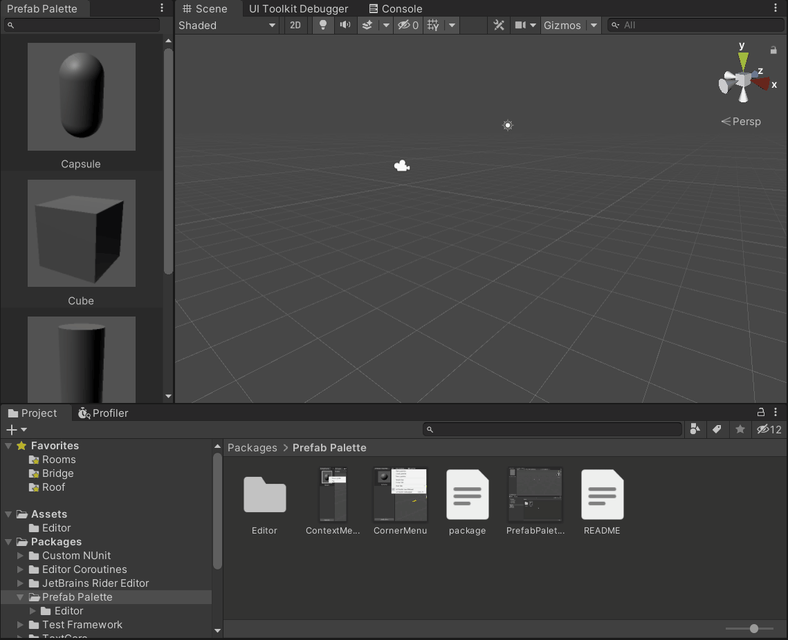

# Prefab Palette
Prefab Palette allows you to put your frequently used prefabs somewhere easy to reach so you don't need to move form a folder to another to find a prefab and put it in the scene. 
You can also save a palette to use it later in your project.
## Installation
In the Package Manager window, click on the plus button and choose "Add package from git URL". Then, paste the url of this repo in the text box. 
**Compatibility: This tool is tested with Unity 2021.1.2f1 and 2020.2.0f1. The minimum supported version is set to 2020.2**

## How to use
You can open prefab palette from `Window -> Prefab Palette`. 
Drag the prefab you want from the Project window to the area marked with a plus to add them to your palette.

You can save, load and clear palettes by using the menu on the upper right corner of the window.

You can also search for a specific prefab in your palette.

You can also remove or ping the prefab you want by right-clicking on it.

## Contribution
If you found a bug, or think there's a feature that is nice to have, feel free to create an issue, or fork this repo, apply your changes and submit a pull request.

---
Images for icons are made by [Freepik](https://www.freepik.com), [icon-icons](PrefabPaletteSearch.gif). 

