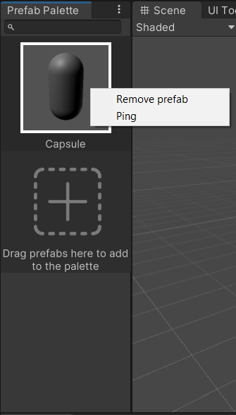

# Prefab Palette
Prefab Palette allows you to put the frequently used prefabs somewhere easy to reach so you don't need to move form a folder to another one to find a prefab and put it in the scene, so you can save your time, energy and sanity for more important things.
You can also save a palette to use it later in your project and load it with a couple of clicks.
## Installation
In the Package Manager window, click on the plus button and choose "Add package from git URL". Then, paste the url of this repo in the text box.
## How to use
You can open prefab palette in `Edit -> Prefab Palette`
Drag the prefab you want from the Project window, to one of hte slots.

You can add new slots, as many as you want with the button in the bottom.
You can also remove and ping the prefabs you wnat by right-clicking on it.

You can save, load and clear palette by using the menu on the upper right cornent of the window.

## Contribution
If you found a bug, or think there's a feature that is nice to have, feel free to create an issue, or if you feel like it, fork this repo and submit a pull request.

---
Images for icons are made by [Freepik](https://www.freepik.com).

