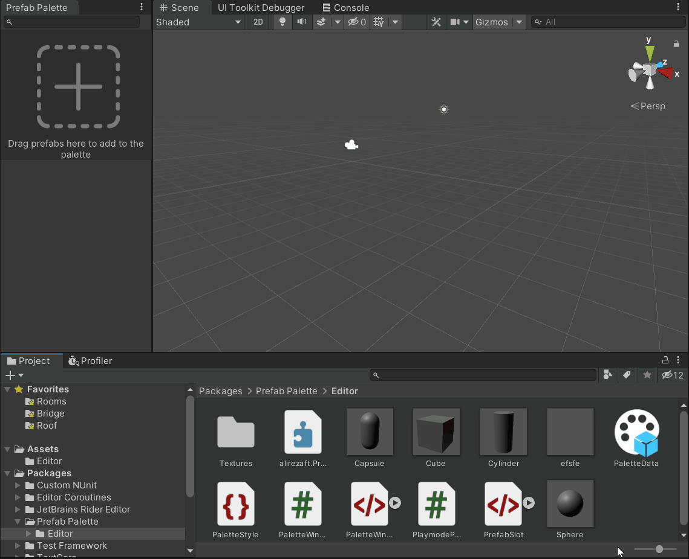

# Prefab Palette
Prefab Palette allows you to put your frequently used prefabs somewhere easy to reach so you don't need to move form a folder to another to find a prefab and put it in the scene, so you can save your time and energy for more important things. 
You can also save a palette to use it later in your project.
## Installation
In the Package Manager window, click on the plus button and choose "Add package from git URL". Then, paste the url of this repo in the text box.
## How to use
You can open prefab palette from `Edit -> Prefab Palette`
Drag the prefab you want from the Project window to one of the slots.

You can add new slots, as many as necessary using the button in the bottom. 
You can also remove or ping the prefab you want by right-clicking on it.

You can save, load and clear palettes by using the menu on the upper right corner of the window.

## Contribution
If you found a bug, or think there's a feature that is nice to have, feel free to create an issue, or fork this repo, apply your changes and submit a pull request.

---
Images for icons are made by [Freepik](https://www.freepik.com).

